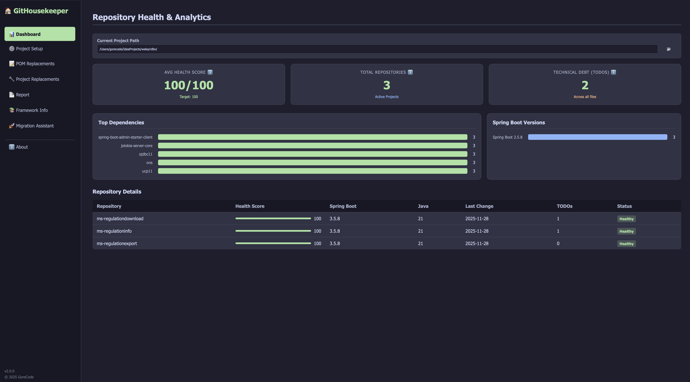
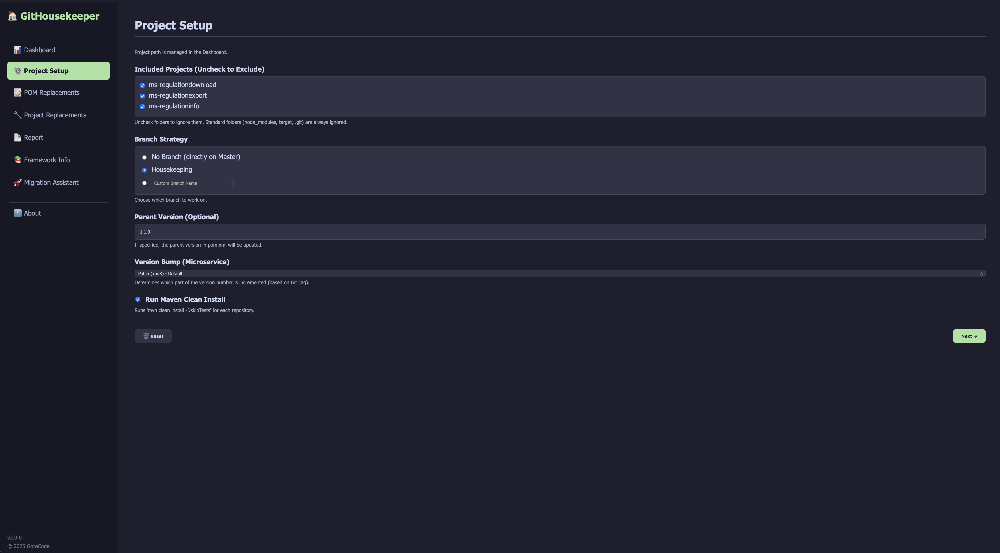
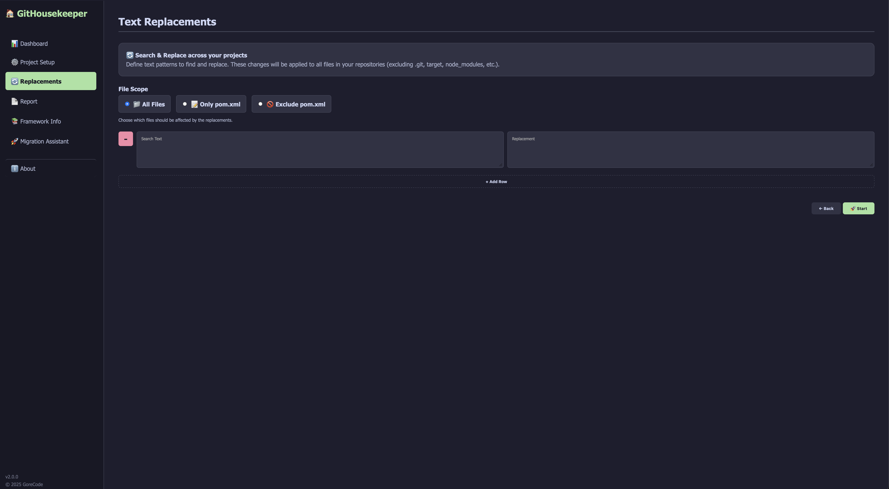
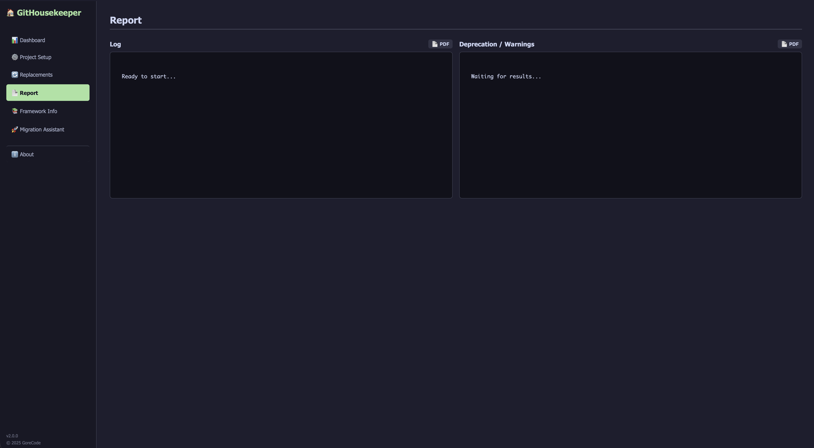
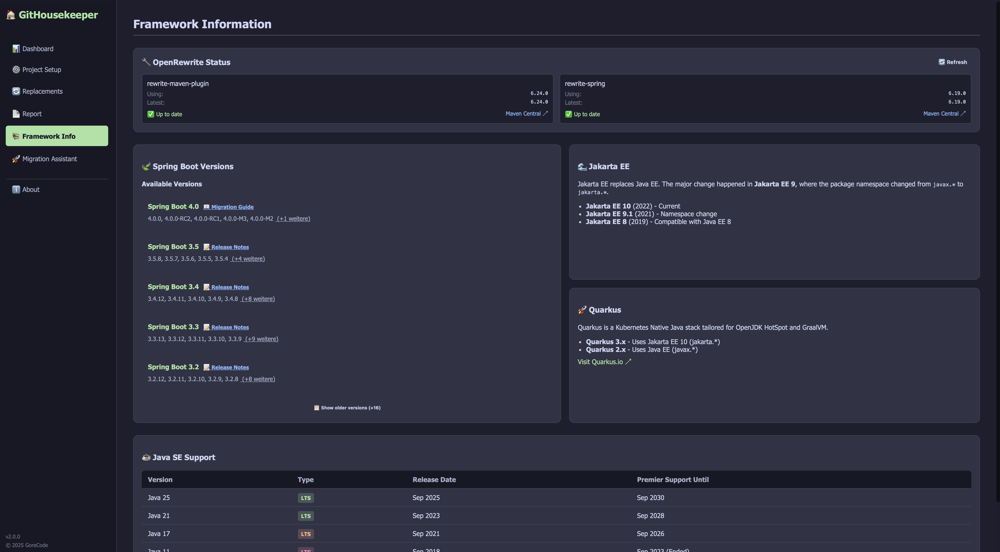
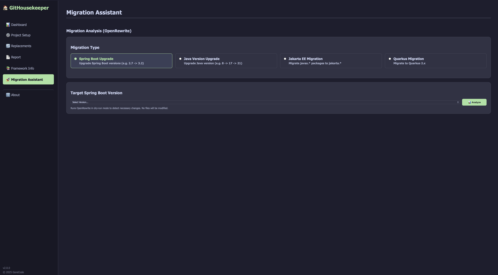

# GitHousekeeper

GitHousekeeper is a powerful tool designed to automate maintenance tasks and mass-refactoring across multiple Git repositories. It provides a user-friendly Web GUI to orchestrate updates, manage versions, and perform project-wide replacements efficiently.

Supports **Maven**, **Node.js** (npm/yarn/pnpm), **Go**, **Python**, and **PHP** projects.

## 📥 Download

**Current Version: 2.4.0**

Download the pre-built executable for your platform:

| Platform                  | Download                                                                                                                                    | Notes                |
| ------------------------- | ------------------------------------------------------------------------------------------------------------------------------------------- | -------------------- |
| **Windows**               | [GitHousekeeper-windows-amd64.exe](https://github.com/gorecodecom/GitHousekeeper/releases/latest/download/GitHousekeeper-windows-amd64.exe) | 64-bit Windows 10/11 |
| **macOS (Intel)**         | [GitHousekeeper-darwin-amd64](https://github.com/gorecodecom/GitHousekeeper/releases/latest/download/GitHousekeeper-darwin-amd64)           | Intel-based Macs     |
| **macOS (Apple Silicon)** | [GitHousekeeper-darwin-arm64](https://github.com/gorecodecom/GitHousekeeper/releases/latest/download/GitHousekeeper-darwin-arm64)           | M1/M2/M3 Macs        |
| **Linux**                 | [GitHousekeeper-linux-amd64](https://github.com/gorecodecom/GitHousekeeper/releases/latest/download/GitHousekeeper-linux-amd64)             | 64-bit Linux         |

> 💡 **Tip**: On macOS/Linux, you may need to make the file executable: `chmod +x GitHousekeeper-*`

See [CHANGELOG.md](CHANGELOG.md) for release history and all versions on the [Releases page](https://github.com/gorecodecom/GitHousekeeper/releases).

## Features

### 🔍 Multi-Repository Management

- **Auto-Discovery**: Automatically finds all Git repositories within a specified root directory.
- **Selective Processing**: Include/exclude specific projects via checkbox selection.
- **Batch Operations**: Apply changes across dozens of repositories simultaneously.

### 🛡️ Security Vulnerability Scanner (Enhanced in v2.4.0)

- **Full-Stack Support**: Scan **Maven**, **Node.js**, **Go**, **Python**, and **PHP** projects.
- **Branch Selection**: Choose which branch to scan (main, develop, feature branches, etc.).
- **Auto-detect Mode**: Automatically detects project type and uses appropriate scanner.
- **Multi-Scanner Support**:
  - OWASP Dependency-Check (Maven)
  - Trivy (Maven + Node.js)
  - npm/yarn/pnpm audit (Node.js)
  - govulncheck (Go)
  - pip-audit (Python)
  - composer audit (PHP)
- **Yarn Berry Support**: Full support for Yarn Modern (v2/v3/v4) with corepack integration.
- **Parallel Scanning**: Analyzes up to 4 repositories simultaneously.
- **Severity Grouping**: CVEs organized by Critical, High, Medium, Low.
- **Project Type Badges**: Visual indicators showing ☕ Maven, 📦 npm, 🧶 yarn, ⚡ pnpm, 🐹 Go, 🐍 Python, 🐘 PHP.
- **NVD Links**: Direct links to National Vulnerability Database for details.
- **Per-Repo PDF Export**: Export security reports for individual repositories.
- **Full Report Export**: Export comprehensive PDF for all scanned projects.

### 🔧 Maintenance Tab (NEW in v2.3.0)

- **Branch Overview**: View all local branches per repository with tracking status.
- **Ahead/Behind Counts**: See how many commits each branch is ahead or behind.
- **One-Click Sync**: Fetch and pull all tracked branches across all repositories.
- **Live Progress**: Real-time progress bar and detailed sync log.

### 🌐 Modern Web Interface

- **Live-Logging**: Real-time feedback during build and update processes.
- **Settings Persistence**: Automatically remembers your paths and configuration between sessions.
- **Native Folder Picker**: OS-native dialog to select folders easily.
- **Dark Theme**: Easy on the eyes for extended use.

### 🏷️ Automated Versioning

- Detects the latest Git tag per repository.
- Updates the project version in `pom.xml`.
- Supports **Major**, **Minor**, and **Patch** version bumping strategies.

### 🔄 Mass Search & Replace

- **Unified Replacements Tab**: Single interface with file scope selection.
- **Scope Options**: Choose between "All Files", "Only pom.xml", or "Exclude pom.xml".
- **Fuzzy Matching**: Smart search that handles whitespace and indentation differences.
- **Smart Indentation**: Automatically detects and preserves the indentation of replaced blocks, ensuring clean XML/code formatting.

### 🛠️ Maven Integration

- Updates `<parent>` versions in `pom.xml`.
- **Optimized Build**: Runs `mvn clean install` and checks for deprecation warnings in a single efficient pass.
- **Deprecation Reporting**: Captures and displays the top 100 deprecation warnings per repository in a dedicated view.

### 🍃 Spring Boot Insights

- **Version Dashboard**: View all available Spring Boot versions (grouped by Major.Minor) fetched live from Maven Central.
- **Migration Guides**: Direct links to official migration guides for major version upgrades.
- **Project Scanning**: Scans local repositories to identify their current Spring Boot parent version.
- **Expandable Version List**: Shows the 5 newest version branches by default, with option to show older versions.

### 🚀 Spring Boot Migration Analysis (OpenRewrite)

- **Parallel Processing**: Analyzes multiple projects simultaneously using Go routines for maximum speed.
- **Progress Tracking**: Visual progress bar with percentage, ETA, and estimated remaining time.
- **Smart Summary**: Categorizes proposed changes instead of showing raw patch output:
  - 🔄 **Annotation Updates** (e.g., `@RequestMapping` → `@GetMapping`)
  - 📦 **Import Changes**
  - 🛠️ **Code Modernization** (e.g., Pattern Matching, `String.formatted()`)
  - ⚙️ **Configuration Changes** (deprecated properties)
  - 🗑️ **Deprecated Code Removal** (e.g., unnecessary `@Autowired`)
- **Dry-Run Mode**: Analyzes projects without modifying any files.
- **Zero-Config**: Injects the OpenRewrite Maven plugin dynamically—no changes to your `pom.xml` required.
- **Version Monitoring**: Displays current vs. latest OpenRewrite versions with update notifications.
- **Latest Recipes**: Uses OpenRewrite Maven Plugin 6.24.0 with rewrite-spring 6.19.0 (supports Spring Boot 3.5).

### 📊 Reporting & Export

- Detailed execution log with color-coded output.
- **PDF Export**: Export the general log or the deprecation report as a PDF file.

### 🔔 Error Handling & Notifications

- **Toast Notifications**: Real-time feedback for success, errors, and warnings.
- **Connection Monitoring**: Automatic detection of offline status and server health.
- **Process Protection**: Warning dialog when closing browser with running operations.

### ♿ Accessibility

- **Keyboard Navigation**: Full keyboard support for sidebar and all interactive elements.
- **Screen Reader Support**: ARIA labels, roles, and semantic HTML throughout.
- **Focus Indicators**: Clear visual focus states for keyboard users.
- **WCAG AA Compliance**: Improved color contrast ratios.

### 🔀 Git Automation

- **Auto-Detect Default Branch**: Automatically detects `main` or `master` per repository.
- **Flexible Branching Strategy**:
  - **Housekeeping**: Default mode. Manages a `housekeeping` branch (resets if stale > 1 month).
  - **Custom Branch**: Work on a specific feature branch (e.g., `feature/upgrade-v2`).
  - **Direct to Default**: Option to apply changes directly to the default branch (`main` or `master`).
- Automatically commits changes with descriptive messages.

## Prerequisites

To run the pre-built executable:

- **Git**: Must be installed and available in the system PATH.
- **Maven**: Required for project builds, OpenRewrite analysis, and OWASP security scans.
- **Java**: JDK 17+ recommended for Spring Boot 3.x projects.
- **Trivy** _(optional)_: For faster security scanning. Install via `brew install trivy` (macOS) or see [trivy.dev/installation](https://aquasecurity.github.io/trivy/latest/getting-started/installation/).
- **govulncheck** _(optional)_: For Go vulnerability scanning. Install via `go install golang.org/x/vuln/cmd/govulncheck@latest`.
- **pip-audit** _(optional)_: For Python vulnerability scanning. Install via `pip install pip-audit`.
- **Composer** _(optional)_: For PHP vulnerability scanning. Requires Composer 2.4+.

To build from source:

- **Go**: Version 1.21 or higher.

## Installation & Usage

### Option A: Run Pre-built Executable

#### Windows

1. Download `GitHousekeeper-windows-amd64.exe` from the [Releases page](https://github.com/gorecodecom/GitHousekeeper/releases).
2. Double-click the `.exe` file.
3. Your browser will open automatically at `http://localhost:8080`.

#### macOS

1. Download the appropriate version for your Mac:

   - **Intel Mac**: `GitHousekeeper-darwin-amd64`
   - **Apple Silicon (M1/M2/M3)**: `GitHousekeeper-darwin-arm64`

2. Open Terminal and make the file executable:

   ```bash
   chmod +x ~/Downloads/GitHousekeeper-darwin-*
   ```

3. On first run, macOS may block the app. To allow it:

   - Right-click the file → **Open**, or
   - Go to **System Preferences → Security & Privacy → General** and click **Open Anyway**

4. Run the application:

   ```bash
   ~/Downloads/GitHousekeeper-darwin-arm64
   ```

5. Your browser will open automatically at `http://localhost:8080`.

#### Linux

1. Download `GitHousekeeper-linux-amd64` from the [Releases page](https://github.com/gorecodecom/GitHousekeeper/releases).

2. Make the file executable:

   ```bash
   chmod +x GitHousekeeper-linux-amd64
   ```

3. Run the application:

   ```bash
   ./GitHousekeeper-linux-amd64
   ```

4. Your browser will open automatically at `http://localhost:8080`.

   > **Note**: On Linux, the folder picker dialog requires `zenity` (GNOME/GTK) or `kdialog` (KDE) to be installed.

### Option B: Build from Source

#### Prerequisites

- **Go**: Version 1.21 or higher ([Download](https://go.dev/dl/))

#### Build Steps (All Platforms)

1. **Clone the repository**:

   ```bash
   git clone https://github.com/gorecodecom/GitHousekeeper.git
   cd GitHousekeeper
   ```

2. **Build for your current platform**:

   ```bash
   go build -o GitHousekeeper .
   ```

   Or build for a specific platform:

   ```bash
   # Windows
   GOOS=windows GOARCH=amd64 go build -o GitHousekeeper-windows-amd64.exe .

   # macOS Intel
   GOOS=darwin GOARCH=amd64 go build -o GitHousekeeper-darwin-amd64 .

   # macOS Apple Silicon
   GOOS=darwin GOARCH=arm64 go build -o GitHousekeeper-darwin-arm64 .

   # Linux
   GOOS=linux GOARCH=amd64 go build -o GitHousekeeper-linux-amd64 .
   ```

   > 💡 The HTML/CSS/JS assets are embedded directly into the executable. You only need the single binary file to run the app.

3. **Run**:
   ```bash
   ./GitHousekeeper
   ```

### Development Mode

If you want to modify the frontend (HTML/CSS/JS) without rebuilding the Go application:

1. Ensure the `assets` folder is present in the same directory as the executable.
2. Run the application. It will detect the `assets` folder and serve files from disk instead of the embedded filesystem.
3. Refresh your browser to see changes instantly.

## Workflow

GitHousekeeper provides 8 main tabs, each with specific workflows for different tasks.

---

### 📊 Dashboard

The Dashboard provides an at-a-glance overview of your entire repository landscape.

**What you see:**

- **Avg Health Score**: Aggregated repository health (0-100%) based on deprecations, TODOs, and version status.
- **Total Repositories**: Number of repositories discovered in your root path.
- **Technical Debt**: Count of TODO comments found across all projects.
- **Top Dependencies Chart**: Pie chart showing the most common dependencies.
- **Spring Boot Versions Chart**: Distribution of Spring Boot versions across repositories.
- **Repository Details Table**: Sortable table with branch, version, deprecations, and TODOs per repo.

**Usage:**

1. Configure your **Root Path** first (via Project Setup tab).
2. The Dashboard automatically refreshes after scanning.
3. Click on any repository row to see detailed information.
4. Use the health indicators (🟢 Good / 🟡 Warning / 🔴 Critical) to identify projects needing attention.

---

### 🔧 Maintenance

The Maintenance tab helps you keep all local branches synchronized with their remotes.

**Workflow:**

1. Navigate to the **Maintenance** tab.
2. Click **🔄 Refresh** to load all repositories and their branches.
3. Review the branch cards showing:
   - Current tracking status (tracked/untracked)
   - Commits **ahead** (local changes not pushed)
   - Commits **behind** (remote changes not pulled)
4. Click **⬇️ Sync All Tracked Branches** to fetch and fast-forward pull all tracked branches.
5. Monitor the **progress bar** and **sync log** for real-time status.

**Use cases:**

- Morning sync before starting work
- After returning from vacation to catch up on all team changes
- Before running migrations to ensure you have the latest code

---

### ⚙️ Project Setup

Configure which repositories to process and how.

**Settings:**

1. **Root Folder**: Click **📂 Browse** to select the directory containing your repositories.
2. **Included Repositories**: Check/uncheck repositories to include or exclude from processing.
3. **Branch Strategy**:
   - **None (direct to default)**: Apply changes directly to `main` or `master`.
   - **Housekeeping branch**: Create/use a dedicated `housekeeping` branch (resets if stale > 1 month).
   - **Custom branch**: Specify your own branch name (e.g., `feature/spring-boot-3`).
4. **Parent Version**: Enter a new parent version for `pom.xml` updates (e.g., `3.2.5`).
5. **Version Bump Strategy**: Choose **Patch** (0.0.X), **Minor** (0.X.0), or **Major** (X.0.0).
6. **Maven Clean Install**: Check to run `mvn clean install -DskipTests` after changes.

**Tips:**

- Use "Housekeeping branch" for routine maintenance to keep your default branch clean.
- Use "Custom branch" for major migrations that require review.
- Parent Version updates the `<parent><version>` in your `pom.xml`.

---

### 🔄 Replacements

Perform mass search and replace across multiple repositories.

**Workflow:**

1. Navigate to the **Replacements** tab.
2. **Select File Scope**:
   - **All Files**: Search across all text files.
   - **Only pom.xml**: Limit changes to Maven POM files only.
   - **Exclude pom.xml**: Search all files except POMs.
3. **Add Replacement Rows**: Click **➕ Add Row** for each search/replace pattern.
4. Enter your **Search** text and **Replace** text.
5. Click **Start** to execute.
6. Review changes in the **Report** tab.

**Features:**

- **Fuzzy Matching**: Handles whitespace and indentation differences intelligently.
- **Smart Indentation**: Preserves original indentation when replacing XML/code blocks.
- **Multiple Patterns**: Add as many search/replace rows as needed.

**Example use cases:**

- Update artifact versions: `<version>1.0.0</version>` → `<version>2.0.0</version>`
- Rename packages: `com.oldcompany` → `com.newcompany`
- Update deprecated APIs across all services

---

### 📋 Report

View execution logs and deprecation warnings.

**Panels:**

1. **Log Panel**: Real-time execution log showing:
   - Repository processing status
   - Git operations (checkout, commit, push)
   - Maven build output
   - Success/error messages with color coding
2. **Deprecation/Warnings Panel**: Captured warnings from Maven builds:
   - Top 100 deprecation warnings per repository
   - Compiler warnings about deprecated APIs
   - Links to problematic files and line numbers

**Actions:**

- **🖨️ PDF / Print**: Export each panel as a PDF document.
- Scroll through logs to review detailed output.
- Warnings help identify technical debt to address.

---

### ℹ️ Framework Info

Reference information about supported frameworks and versions.

**Sections:**

1. **OpenRewrite Status**: Shows current and latest OpenRewrite Maven plugin versions with update notifications.
2. **Spring Boot Versions**: List of all Spring Boot releases grouped by major.minor version.
   - Click **Show More** to see older versions.
   - Direct links to official migration guides.
3. **Jakarta EE**: Migration information for javax._ → jakarta._ namespace.
4. **Quarkus**: Quarkus framework version information.
5. **Java SE Support**: Table of Java versions with:
   - LTS indicators (Long-Term Support)
   - Release dates
   - Premier Support end dates
   - Status badges (🟢 Current / 🟡 Ending Soon / 🔴 Ended)

**Use cases:**

- Check which Spring Boot version to target for migration
- Verify Java version support timelines
- Quick reference during upgrade planning

---

### 🔬 Migration Assistant

Analyze projects for framework migrations using OpenRewrite.

**Migration Types:**

- **Spring Boot Upgrade**: Migrate between Spring Boot versions (e.g., 2.7 → 3.2).
- **Java Version Upgrade**: Upgrade Java version (e.g., 8 → 17 → 21).
- **Jakarta EE Migration**: Migrate javax._ packages to jakarta._.
- **Quarkus Migration**: Migrate to Quarkus 2.x framework.

**Workflow:**

1. Navigate to the **Migration Assistant** tab.
2. Select a **Migration Type** (radio buttons).
3. Choose the **Target Version** from the dropdown.
4. Click **📊 Analyze** to start the OpenRewrite dry-run.
5. Monitor the **progress bar** with:
   - Repository count progress
   - ETA and percentage
   - Live status per repository (✓ done, ⏳ in progress, ⏸ pending)
6. Review the **Analysis Report** showing categorized changes:
   - 🔄 Annotation Updates
   - 📦 Import Changes
   - 🛠️ Code Modernization
   - ⚙️ Configuration Changes
   - 🗑️ Deprecated Code Removal
7. Click **🖨️ PDF / Print** to export the analysis.

**Notes:**

- Analysis runs in **dry-run mode**—no files are modified.
- OpenRewrite plugin is injected dynamically, no changes to your `pom.xml`.
- Use the analysis to plan your migration before applying changes.

---

### 🛡️ Security Scanner

Scan repositories for CVE vulnerabilities in dependencies. Supports **Maven**, **Node.js**, **Go**, **Python**, and **PHP** projects.

**Scanner Options:**

- **🔄 Auto-detect (recommended)**: Automatically detects project type and uses the best scanner:
  - `pom.xml` → OWASP Dependency-Check
  - `package-lock.json` → npm audit
  - `yarn.lock` → yarn audit
  - `pnpm-lock.yaml` → pnpm audit
  - `go.mod` → govulncheck
  - `requirements.txt` / `pyproject.toml` → pip-audit
  - `composer.json` → composer audit
- **☕ OWASP Dependency-Check**: For Maven projects. Uses Maven plugin, no additional install needed. Comprehensive CVE database. First scan downloads vulnerability database (~10 minutes).
- **🐳 Trivy**: Fast scanner by Aqua Security. Supports Maven and Node.js. Requires separate installation. See install hints in the UI.
- **📦 npm/yarn/pnpm audit**: For Node.js projects. Uses native package manager security auditing. No additional installation required.
  - **Yarn Berry Support**: Full support for Yarn v2, v3, and v4 (Berry). Automatically detects version via `packageManager` field in `package.json` and uses Corepack when needed.
- **🐹 govulncheck**: Official Go vulnerability scanner from the Go team. Install via `go install golang.org/x/vuln/cmd/govulncheck@latest`.
- **🐍 pip-audit**: Python package vulnerability scanner by PyPA. Install via `pip install pip-audit`.
- **🐘 composer audit**: Official PHP vulnerability scanner. Requires Composer 2.4+.

**Supported Project Types:**

| Project Type | Lock File | Scanner |
|-------------|-----------|---------|
| Maven | `pom.xml` | OWASP / Trivy |
| npm | `package-lock.json` | npm audit / Trivy |
| Yarn Classic (v1) | `yarn.lock` | yarn audit / Trivy |
| Yarn Berry (v2/v3/v4) | `yarn.lock` + `packageManager` | yarn npm audit / Trivy |
| pnpm | `pnpm-lock.yaml` | pnpm audit / Trivy |
| Go | `go.mod` | govulncheck |
| Python | `requirements.txt` / `pyproject.toml` | pip-audit |
| PHP | `composer.json` | composer audit |

**Yarn Version Detection:**

GitHousekeeper automatically detects your Yarn version:
- If `package.json` contains `"packageManager": "yarn@4.x.x"`, uses Corepack + Yarn Berry commands
- If no `packageManager` field, checks global `yarn --version`
- Yarn Classic (v1.x): Uses `yarn audit --json`
- Yarn Berry (v2+): Uses `corepack yarn npm audit --json`

**Workflow:**

1. Navigate to the **Security Scanner** tab.
2. Click **🔄 Refresh** to load repositories from your configured root path.
3. Select a **Scanner Engine** from the dropdown (Auto-detect recommended).
4. **(Optional)** Select a **Target Branch** to scan all repos on a specific branch:
   - Default: "Current branch" - scans whatever is currently checked out
   - Select a branch (e.g., `main`, `develop`) to temporarily switch and scan
   - Branch switching is safe: uncommitted changes are stashed and restored
5. Click **🔍 Scan for Vulnerabilities**.
6. Monitor the **progress bar** and live scan status.
7. Review the **Security Summary**:
   - Total repositories scanned
   - Total CVEs found
   - Breakdown by severity: Critical, High, Medium, Low
8. Examine **per-repository results** showing:
   - Project type badge (☕ Maven, 📦 npm, 🧶 yarn, ⚡ pnpm, 🐹 Go, 🐍 Python, 🐘 PHP)
   - Vulnerability count and severity badges
   - CVE IDs with direct NVD links
   - Affected components and versions
9. Click **📄 Export PDF** for a comprehensive security report.

**Tips:**

- Use **Auto-detect** to scan mixed Java/Node.js/Go/Python/PHP workspaces seamlessly.
- Run OWASP first if you don't have Trivy installed (Maven projects).
- For Go projects: install govulncheck via `go install golang.org/x/vuln/cmd/govulncheck@latest`.
- For Python projects: install pip-audit via `pip install pip-audit`.
- For PHP projects: ensure Composer 2.4+ is installed.
- Schedule regular scans to catch new vulnerabilities.
- Focus on Critical and High severity CVEs first.
- Export PDF reports for compliance documentation.
- For Yarn Berry projects: ensure `corepack enable` has been run if using `packageManager` field.

**Known CVEs detected:**

The scanner detects critical vulnerabilities like:
- **CVE-2025-66478 / CVE-2025-55182**: Critical RCE in Next.js React Server Components (affects Next.js 15.x, 16.x)
- And thousands more from npm advisory database, GHSA, and NVD.

---

### ℹ️ About

Information about the application, version, and links.

- **Version**: Current GitHousekeeper version.
- **Feature Summary**: Quick overview of all capabilities.
- **Links**:
  - GitHub Repository
  - Report Issues
  - Contributing Guide
  - Security Policy
  - Author Profile

---

### Quick Start (General Housekeeping)

For a typical maintenance workflow:

1. **Configure** (Project Setup tab):

   - Select your **Root Path** containing repositories.
   - Check/uncheck repositories to include.
   - Set **Branch Strategy** (recommended: Housekeeping).
   - Configure **Version Bump** if updating versions.

2. **Define Replacements** (Replacements tab):

   - Add search/replace patterns.
   - Select appropriate **File Scope**.

3. **Execute**:

   - Click **Start** to begin processing.
   - Monitor **Live Log** in Report tab.
   - Review **Deprecation Warnings**.
   - Export reports to PDF if needed.

4. **Verify**:
   - Check the generated commits in your repositories.
   - Review and merge the housekeeping branches.

## Screenshots

### Dashboard


_Repository health overview with analytics and metrics_

### Project Setup


_Configure projects, branch strategy, and version settings_

### Replacements


_Unified search and replace with file scope selection (All Files / Only pom.xml / Exclude pom.xml)_

### Report


_Live execution log with deprecation warnings_

### Framework Info


_Spring Boot versions, Java SE support matrix, and framework references_

### Migration Assistant


_OpenRewrite-powered migration analysis for Spring Boot, Java, and Jakarta EE_

## Contributing

Contributions are welcome! Please read our [Contributing Guide](CONTRIBUTING.md) for details on:

- Setting up the development environment
- Code style guidelines
- Submitting pull requests

## ❤️ Sponsor this Project

If **GitHousekeeper** saves your team hours of manual migration and maintenance work, consider [sponsoring the project](https://github.com/sponsors/gorecodecom) to ensure its continued development.

### 🏆 Corporate Sponsors

Does your company use GitHousekeeper? [Become a sponsor](https://github.com/sponsors/gorecodecom) to get your logo displayed here and support open source!

<!--
Sponsor logos will appear here:
<a href="https://example.com"></a>
-->

_Your company could be here! [Sponsor now →](https://github.com/sponsors/gorecodecom)_

## Security

Found a vulnerability? Please read our [Security Policy](SECURITY.md) for responsible disclosure guidelines.

## Author

**GoreCode**
GitHub: [@gorecodecom](https://github.com/gorecodecom)

## License

[MIT](LICENSE) © 2025 GoreCode

---

Made with ❤️ for developers who manage multiple repositories across Java, Node.js, Go, Python, and PHP.
